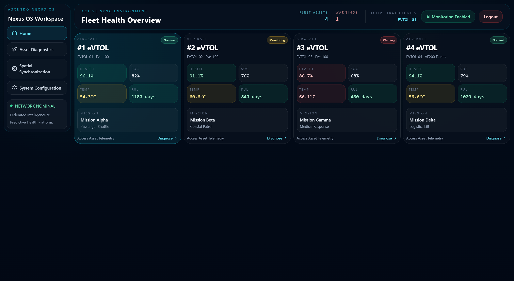
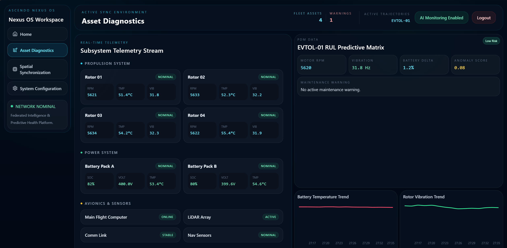
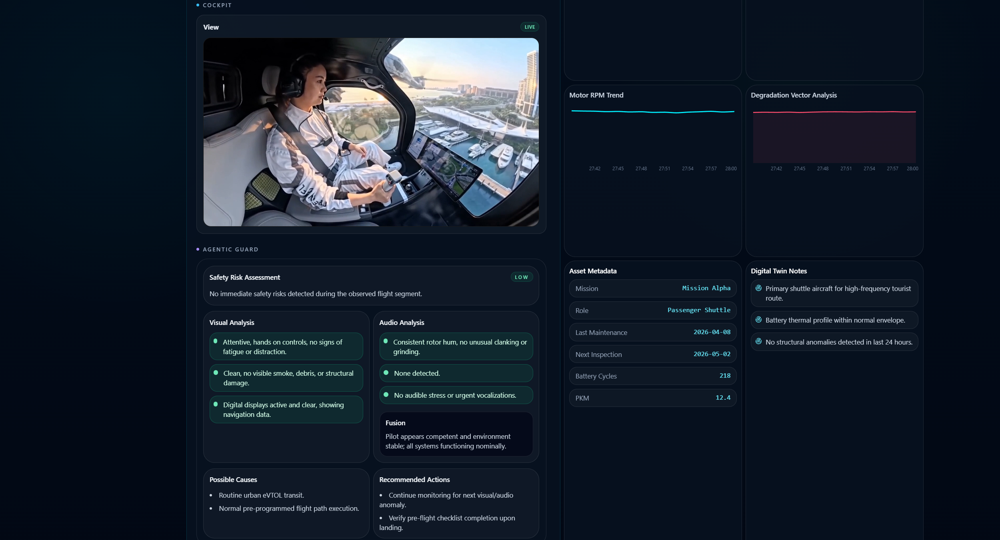
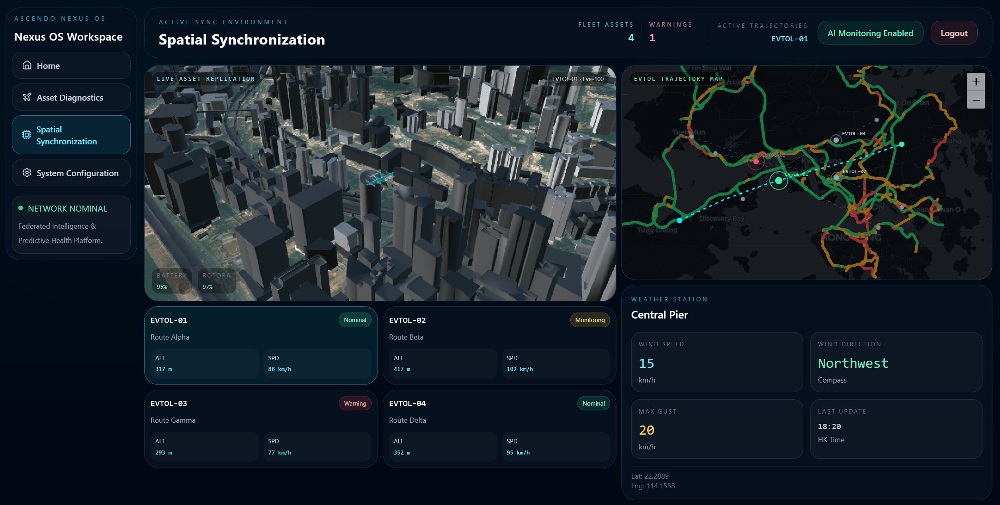
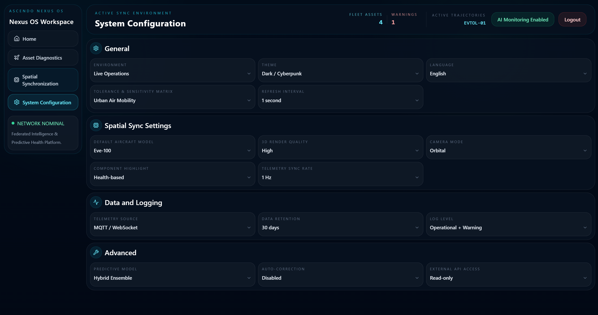

# ASCENDO NEXUS OS

> An operations-facing digital-twin showcase for eVTOL fleet health, predictive diagnostics, spatial awareness, and safety intelligence.


**Ascendo Nexus OS** is a proof-of-concept command interface for monitoring an urban air-mobility fleet. It brings asset telemetry, health indicators, eVTOL trajectories, 3D city context, road conditions, weather context, and AI-oriented safety findings into one operator workspace.

The current implementation is a frontend prototype with simulated fleet telemetry and local configuration. It is designed to make the operator journey tangible while leaving clear integration boundaries for production data, models, and identity services.

## Product Showcase

### Fleet Health Overview

The home workspace gives operators a compact, fleet-level view of aircraft state. Each asset exposes health, state of charge, temperature, remaining useful life, mission context, and a status classification so attention can move immediately to exceptions.



### Asset Diagnostics and Predictive Maintenance

The diagnostics workspace combines subsystem telemetry with a predictive-maintenance matrix. Rotor, battery, avionics, and sensor readings are presented alongside trend charts, anomaly scoring, battery delta, and a maintenance warning surface.



### AI-Assisted Safety Context

The detailed asset view pairs flight context with a cockpit feed and a structured safety assessment. Visual and audio findings are synthesized into risk status, possible causes, recommended actions, digital-twin notes, and maintenance metadata.



### Spatial Synchronization

The spatial workspace joins a live 3D scene with a 2D operational map. Operators can inspect eVTOL position and trajectory in Hong Kong, compare fleet routing with road-speed conditions, and review local weather context alongside aircraft altitude and speed.



### Operational Configuration

The configuration surface makes operating assumptions visible: environment, refresh interval, 3D camera and rendering options, data retention, logging, and predictive-model settings. Settings such as MQTT/WebSocket are represented as integration targets for a production telemetry pipeline.



## Capabilities

| Domain | Demonstrated experience |
| --- | --- |
| Fleet command | A four-aircraft fleet overview with live-looking health, SOC, temperature, RUL, mission, and warning states. |
| Digital twin | Aircraft metadata and synchronized operational state presented as an inspectable asset record. |
| Telemetry diagnostics | Propulsion, power, avionics, and sensor telemetry with condition labels and time-series visualizations. |
| Predictive maintenance | RUL, anomaly score, battery delta, degradation context, and maintenance-warning presentation. |
| Spatial operations | Animated eVTOL routes, interactive 2D map overlays, strategic road-speed context, and 3D geospatial visualization. |
| Safety intelligence | A UI contract for visual/audio observations, fused safety assessment, recommended action, and flight evidence. |
| Operator ergonomics | Persistent navigation, selected-aircraft context, status-first visual hierarchy, and responsive dashboard layouts. |

## Technology Stack

### Application foundation

- **React 19** provides the component model and state-driven rendering.
- **Vite 8** provides local development, production builds, asset handling, and a development proxy for external feeds.
- **JavaScript (ES modules)** keeps the prototype lightweight while maintaining modular components, hooks, data, and utility layers.
- **Tailwind CSS** and **PostCSS/Autoprefixer** provide the utility-first styling workflow behind the dense operations UI.
- **ESLint** enforces baseline JavaScript and React quality checks.

### State, data, and visualization

- **Zustand** is available for lightweight client-side state management; the app also uses React state and derived state for active page, selection, and fleet aggregates.
- **Custom React hooks** simulate evolving fleet signals and persist the login state with `localStorage` for a continuous operator session.
- **Recharts** renders telemetry trends and diagnostic visualizations.
- **Lucide React** supplies consistent, accessible interface icons.

### 2D and 3D spatial layer

- **CesiumJS** renders the 3D Hong Kong operational scene, including Cesium entities, sampled positions, Hermite interpolation, vehicle orientation, camera tracking, and GLB eVTOL models.
- **vite-plugin-cesium** packages Cesium assets for Vite development and builds.
- **Three.js**, **@react-three/fiber**, and **@react-three/drei** are included for extensible React-native 3D visualization.
- **Leaflet** is loaded by the host page for the 2D trajectory map; custom SVG overlays animate routes and aircraft markers without recreating the base-map renderer.

### Geospatial and public-data integration

- The 3D basemap uses **Hong Kong Lands Department** imagery and can load Hong Kong 3D infrastructure/building tiles when API credentials are configured.
- Strategic road overlays use KML road-network geometry and a Vite-proxied public traffic-speed feed from **data.gov.hk**.
- The local weather panel is structured for an API feed and can be replaced by a production weather provider.

## Architecture

```text
React UI and components
        |
        +-- Fleet simulation and local asset data
        +-- React state / localStorage session state
        +-- Diagnostic charts and safety-response parser
        +-- 2D map, route animation, road-speed overlay
        +-- Cesium 3D viewer, 3D tiles, GLB aircraft model
        |
Vite development proxy --> public traffic-speed XML feed
```

The prototype intentionally keeps its data boundaries visible. A production deployment can replace simulated fleet data with authenticated MQTT/WebSocket ingestion, persist telemetry in a time-series platform, call model-serving endpoints for health predictions, and connect evidence analysis to governed video/audio services.

## Run the Original Demo Locally

The application source is maintained separately from this showcase repository. In the application repository:

```bash
npm install
npm run dev
```

Vite will serve the prototype locally, typically at `http://localhost:5173`.

### Optional spatial-data setup

To render the full road-network overlay, place the required converted KML files under `public/Road_Network_KML/`. A Hong Kong 3D Data API key can also be supplied through the Cesium configuration to enable building and infrastructure tiles.

## Prototype Scope

This is a visual and interaction prototype, not a production flight-management or safety system. Telemetry, AI findings, asset health, and alerts shown in the UI are representative demo data unless connected to a live provider. Any operational deployment requires appropriate safety engineering, security controls, data governance, validation, human oversight, and regulatory approval.

## Repository Contents

```text
.
|-- README.md
`-- assets/
    `-- screenshots/
        |-- fleet-health-overview.png
        |-- asset-diagnostics.png
        |-- ai-safety-context.png
        |-- spatial-synchronization.png
        `-- system-configuration.png
```

## Attribution

- Hong Kong map and 3D data: Hong Kong Lands Department and related public-data services.
- Traffic feed: Hong Kong Transport Department / data.gov.hk.
- UI screenshots: Ascendo Nexus OS prototype.